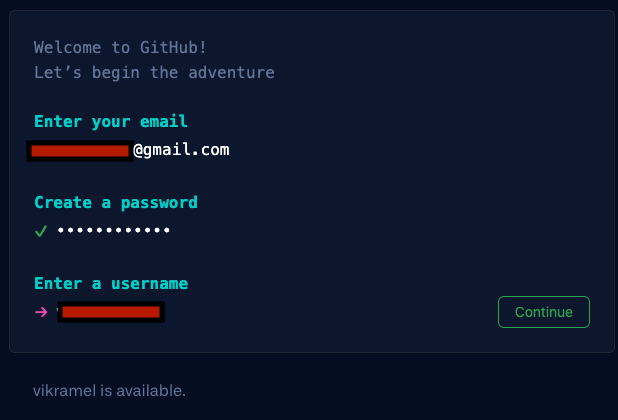

# Unleash the power of ML for your developer operations - Lab

You can implement machine learning (ML) in developer operations even without prior experience. In this builder’s session workshop, learn how you can efficiently improve IT operations with AWS DevOps Guru and see how to improve software quality with CodeGuru.

# Workshop Setup - AWS Account & GitHub Account

Follow the instructions given by the workshop administrators on how to log in to the AWS account provided for this workshop. Do NOT use your personal or business account to run this workshop, as the required pre-built resources will not be available. Read through all steps below and watch the quick video before continuing.

* Step 0: Event Engine AWS Account access
* Step 1 : Github Account
* Step 2 : Pre-requisites for Amazon Code Guru
* Step 3: Code Change: Pull Request
* Assignment

## Step 0 :  Event Engine AWS Account access

Go to: https://dashboard.eventengine.run/login. You will be redirected to the page below.

[Image: image1.png](images/image1.png)
Enter the event hash you have received from your instructor.

[Image: image2.png](images/image2.png)
Click on Email One-Time Password (OTP).

[Image: image3.png](images/image3.png)
You are redirected to the following page:

[Image: image4.png](images/image4.png)
Enter your email address and click on Send passcode.

[Image: image5.png](images/image5.png)
You are redirected to the following page:
[Image: image6.png](images/image6.png)
Check your mailbox, copy-paste the one-time password and click on Sign in.

[Image: image7.png](images/image7.png)
You are redirected to the Team Dashboard. Click on AWS Console.
[Image: image8.png](images/image8.png)

On the next screen, click on Open AWS Console.

[Image: image9.png](images/image9.png)
You are then redirected to the AWS Console.

## Step 1 :  Github Account

* Open a web browser of your choice and navigate to github.com (http://github.com/) and choose Sign Up
* Enter your email id (please make sure you have access to this email account)
* Create a password
* Enter a username
    * 

* Would you like to receive product updates and announcements via email? 
    * no
* Solve the puzzle 
* Create Account
* Enter launch code thats sent to your email id

## Step 2 : Pre-requisites for Amazon Code Guru
Please follow the instructions as per this page https://catalog.us-east-1.prod.workshops.aws/v2/workshops/1786241d-967f-4195-99ef-5716ef485201/en-US/prereq

Note: This step requires your personal Github account

## Step 3: Code Change: Pull Request

Please follow the instructions as per this page https://catalog.us-east-1.prod.workshops.aws/v2/workshops/1786241d-967f-4195-99ef-5716ef485201/en-US/appln

## Assignment

* Try Code Guru profiler : https://catalog.us-east-1.prod.workshops.aws/v2/workshops/1786241d-967f-4195-99ef-5716ef485201/en-US/profiler
* Try Github Action pipeline : https://catalog.us-east-1.prod.workshops.aws/v2/workshops/1786241d-967f-4195-99ef-5716ef485201/en-US/analytics
* Try DevOps Guru : https://aiops-using-devops-guru.workshop.aws/01_introduction.html

